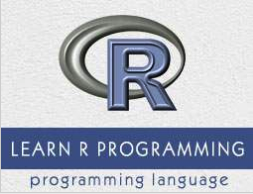

```
Roberto Nogueira  
BSd EE, MSd CE
Solution Integrator Experienced - Certified by Ericsson
```
# Tutorialspoint R



**About This Tutorial**

This is to grasp rapidly the language and its concepts.

[R Tutorial](https://www.tutorialspoint.com/r/index.htm)

#### Topics
```
R Tutorial
[x] Home
[x] Overview
[x] Environment Setup
[x] Basic Syntax
[x] Data Types
[x] Variables
[x] Operators
[x] Decision Making
[x] Loops
[x] Functions
[x] Strings
[x] Vectors
[x] Lists
[x] Matrices
[x] Arrays
[x] Factors
[x] Data Frames
[x] Packages
[x] Data Reshaping
R Data Interfaces
[x] CSV Files
[x] Excel Files
[x] Binary Files
[x] XML Files
[x] JSON Files
[x] Web Data
[x] Database
R Charts & Graphs
[x] Pie Charts
[x] Bar Charts
[x] Boxplots
[x] Histograms
[x] Line Graphs
[x] Scatterplots
R Statistics Examples
[x] Mean, Median & Mode
[ ] Linear Regression
[ ] Multiple Regression
[ ] Logistic Regression
[ ] Normal Distribution
[ ] Binomial Distribution
[ ] Poisson Regression
[ ] Analysis of Covariance
[ ] Time Series Analysis
[ ] Nonlinear Least Square
[ ] Decision Tree
[ ] Random Forest
[ ] Survival Analysis
[ ] Chi Square Tests
R Useful Resources
[ ] Interview Questions
[ ] Quick Guide
[ ] Useful Resources
[ ] Discussion
Selected Reading
[ ] Developer's Best Practices
[ ] Questions and Answers
[ ] Effective Resume Writing
[ ] HR Interview Questions
[ ] Computer Glossary
[ ] Who is Who
```
